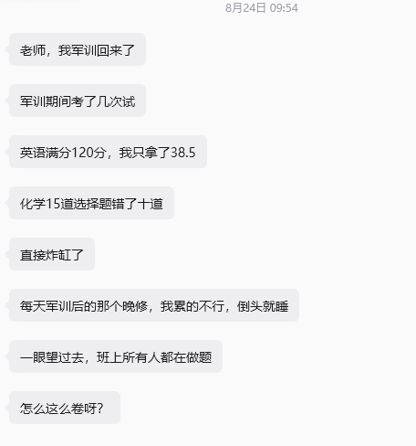
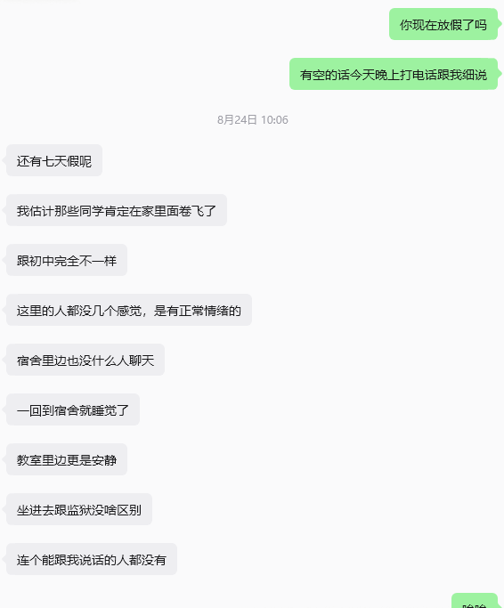
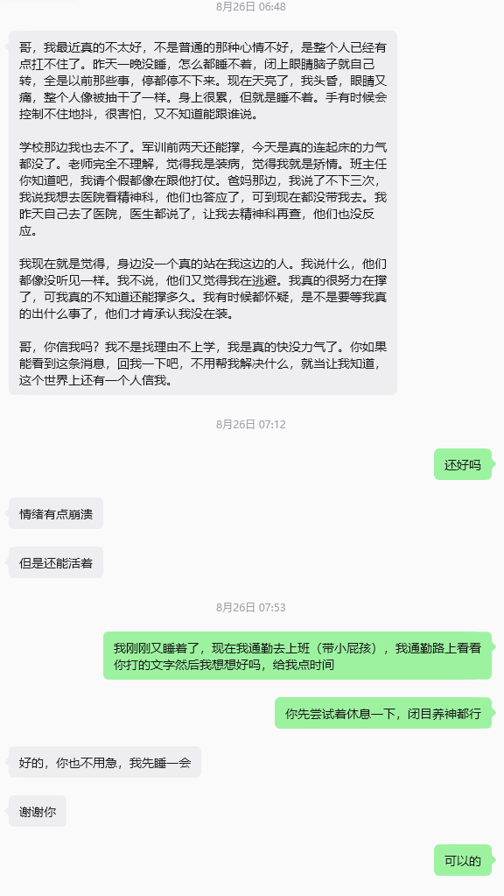
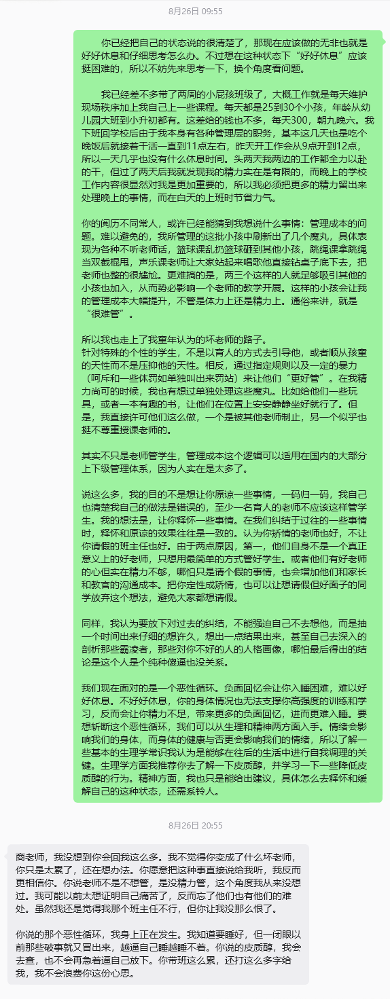

# 当我聊教育时，我聊些什么

当然是聊**怎么摆脱应试教育**，怎么让学生有一个**有趣的童年**，怎么让学生**快乐长大而又能够有所特长**，怎么**让学生找到并活出自己的人生价值**。

————是这样吗？我倒不觉得我能以一个指导者的姿态去输出内容。我只想整理出我八月份跟各种学生——从高三，到初升高，再到一群小学甚至幼儿园的小朋友——打的各种交道，以及在这个过程中不同的学生给我的触动和思考。

## 一、第一个学生
八月初，我来到我加入的机构，并先后辅导了两名初升高学生的英语。

第一名学生七月份考完中考后玩疯了，另外对英语学习也没有什么兴趣。虽然在各种外部的**强而有力的压力**督促下，中考英语考的还可以，但过了一个月英语水平可以说是倒退到了初一的水平。

很明显，他到目前为止的英语学习大部分都是为了应试。当然，作为机构老师，我的首要目标也是通过衔接课程，让他能在高中开学后的英语学习中跟上节奏，最好是能拿到不错的成绩。

但是我，作为一个成长于唯成绩论的家庭环境的孩子，一个在大一阶段探索其他道路并小有成就的人，在我当上所谓的老师后，我一直想要走一条**我没经历过的教育路线**，也是向我的高中英语老师学习——先培养他对学科的兴趣，让他产生学习的内驱力，明白学习**可以是快乐的**，而不是**痛苦的**。毕竟还只是初升高的学生，没必要从现在开始就让他以应试为目的学习。

我自认这十天的课程是成功的。我整理了我高中用到的培养了我对英语的兴趣的各种学习方法——包括利用新概念的各种幽默神秘小故事，看有趣而简单的英文原著小说，看音乐剧，看英剧美剧等等，并把这些方法融合进教学大纲和每天的教学过程中。学生确实也感觉不错，在课程结束后的小测中（测试这十天学到的新单词，新语法等等）成绩也说得过去。

然而，在我后来正和各种低年级小朋友斗智斗勇的时候，一连串的消息轰炸了过来。

我感到震惊，心疼，难过。
10天相处下来，我知道这位学生很单纯，可以说是个阳光开朗大男孩。虽然贪玩，但知道应该好好学习，也有着较强的自尊和上进心。也因此，我为这个结果感到惭愧和担心。因为这个结果一定会一定程度上打击他的上进心，消磨他对英语学习本身的兴趣，以及我最不想看到的，在他和他父母心中种下焦虑和内耗的种子。

接着就是反思。如果衔接课抓的更严，我带着他学习测试更多的单词，更多的面向考试题型教学，是不是他考完试的感受会好一点，是不是面对如此压抑的氛围能有底气，能从容一点，能用成绩好的正反馈反过来滋养兴趣，最终完成我想象中的素养教育。

以及，跳出来看看，一定只是我教的问题吗？他所描述的很显然还有更关键的，更让他困惑的东西：**为什么这么卷啊？**

结合我刚进高中时的经验，其实不一定就是大家都这么卷，而可能是因为大家刚进来都互相不熟，学校又安排了很多的考试，外部施加压力加上自己放不开，导致新生们只能闷头学自己的东西。

但是，如果真的就是这么卷呢？在这里，从一个老师的视角，我发现了一个我之前很少考虑到的问题：我真的能承担起这样教学的责任吗？

## 二、教学的责任

教育是一个老师和学生交互的过程。但从老师的视角来看，这个过程的交互性挺差的，因为老师输出之后，其实很难从学生身上得到精确的反馈。就像我虽然一直引导学生学会发掘学习中有趣的点，鼓励他先建立兴趣再学习方法而不是死记硬背，但他到底有没有认可我的观点，有没有理解并去尝试实践我所教授的学习观念，这些我都不知道，并且无从知道。学生于我，于家长，于除了学生以外的所有人都是一个黑盒，我只能做到输入一大堆东西（知识也好，观念也好），然后通过收集极其有限的一些反馈（分数也好，平常的各种举动习惯也好）来判断我的输入效果如何。

所以每次给学生上完课之后，我常常是一种诚惶诚恐的状态，因为我不知道我的课程是否是有效的。应试教育通过改变评判规则来极大的简化了判断输入效果的过程：通过测试和成绩分析即可。但我想走的，更偏向终身学习和素养培养的路子，要判断效果的话不只是看学校的成绩，更需要看他在日常，在将来的个人发展。

还有外部环境的问题。当我以我想要的方式给这位学生上完课后，他回到学校感受到的却是他的掉队和同学们卷到不行的环境。我当然可以对他说：按照自己的学习节奏来就行，不要管其他人怎么学。但我想这道理每个人都懂，能做到的却很少很少，因为**人对痛苦的感知是远大于快乐的**，外部压力所催生的焦虑，几乎一定会摧毁我先前所努力在他心中建立的观念和方法，而让他也开始卷，进而不愉快的甚至痛苦的度过三年。

以及，再仔细想想。我一直在设法规避应试，其实只是为了让我的学生不要视学习为洪水猛兽，不要被几个分数劫持了自己的兴趣而已。我想起我的高数老师，一个和蔼的小老头，一直试图让我们理解数学分析的美感，并反复强调不要太在意分数——然而台下听他课的人都是少数。我为他感到难过，这或许也是我一直想换个方式教学生的由来。**可我所提倡的不应试，在当前的普遍环境下，真的能带给学生一个更能活出自我的未来吗？**

诚然，在AI的能力日新月异的当下，应试得来的高学历也许并没有鸟用，无非是被取代早晚的问题。我也有想过，在理论研究和工程技能方面干不过AI的情况下，或许学一门好手艺才更能确保自身的温饱。这番考虑下，高中到底能考多少分似乎无足轻重，还不如早早发掘自己的兴趣并享受青春。

然而，在我所接触到的大部分人中，考量未来的方式都是**保底**式，而不是**冒险**式。这种思维的来源无从说起，大抵是小农经济的惯性；但在这种思维模式下，更高分确实对应着一个**更有可能**能保底的未来，哪怕可能到最后高分低分的人，不同大学的人都是被AI或者其他东西当成路边一条，就像旧时代被淘汰的各种东西。

所以其实作为一个老师，一个真心想为学生**负责**的老师，以及一个承担不起让学生冒险的**责任**的老师，最好的教育方式确实是顺应当下的制度来让学生考尽可能高的分。不同老师的点，其实只在于生硬、强迫性的应试，还是尽可能柔和，体贴学生的应试——只是愿不愿意带着镣铐起舞而已。当然，我们都希望遇到后者，但是前者就**一定**指向一个坏人吗?

## 三、第二个学生

我虽然只带过这个学生一节课，但是刚开课的20分钟我就明白了一件事情：他和上一位同学完全相反，他对英语学习很有自己的想法和见解，也有着对英语学习的很大兴趣和出国的打算。总而言之，这初升高的衔接课对他应该是用处不大了，所以后面坐下来和他聊了三个小时的过往和将来的打算。

可以说是很典型的高压家庭，父母成就都很高，自然也对孩子要求严格。他的童年与青少年时期受到过不少创伤，包括亲子矛盾，师生矛盾，校园霸凌等等。也因此，这位学生比之前那位阳光开朗大男孩更加敏感和更加内向，喜欢一个人想事情，思考的深度也超乎我的想象。如果我没有阅读量占优和更丰富的个人经历，我或许很难跟上他的思路。

可以说，他对我是一个很大的惊喜，因为进入大学之后，大家都在忙着自己的事情，很久没有遇到过愿意和我坐下来慢慢聊时事，轻松、平和且深入的交换看法的人了。可以说，短短三个小时内，建立的友谊与信任胜过我与在大学结识的一些朋友。虽然只有一次课，后续的课程因为他要军训而取消了，但还是互相留了微信并且频繁的交流。

然后，在后来我上班带小孩的时候，他给了我一个惊吓。

这个时候，我已经带了一周小孩了（30个左右，年龄从小升初到幼儿园大班都有），渐渐的已经明白了，或者说释怀了一些上学时的事情。所以我在看到这条消息后，虽然一下子困意全无，但后面很快的冷静下来（甚至还能睡着，确实十分冷静了），开始借此梳理我这一周下来的感受。

其实感受最深的，就是管理成本的问题。连轴转的八月，我深刻的认识到了我的精力是有限的，我的情绪也不是随时随地都能保持稳定的。老师在课堂之外，也是普通生活着的人，也是需要处理各种各样繁琐事务的人。我在学校还有着两份职务，且正好在八月，两边都是招新事务比较忙的时候。那迁移到正常的老师，每天除了学校的任务外，也还有家庭的事务，也还有其他的琐事缠身。

所以我想，**学校的规矩很多时候是用来保护学生，但很多时候也主要是用来保护老师**。更何况**破坏规矩**本身有着一种破窗效应，批准一次请假或许看起来并不会带来太多的管理成本，但如果学生请假的成本过低，那么经过口口相传后请假的人就会越来越多，带来管理成本的激增。那么在老师的精力实在有限的情况下，增大违反规则的成本或许才是最优解，这种做法一旦某次过于偏激，就会表现为老师不当人，学校是监狱。

## 四、结语
每个学生都想要一个包容自己个性，容忍自己的个性化发展的环境，这也确实是我们应该争取的环境，而不是歌颂当下把人异化成分数和功能的这个环境。我写这篇随笔的原因，也不是为了给某些不当人的老师和学校开脱，他们确实有能力做的更好，但他们已经习惯了最简单粗暴的管理方式。正如我与学生聊的，**在我们纠结于过往的一些事情时，释怀和原谅的效果往往是一致的**。

另外，我所希望的那种教育方式，那种包容个性，发掘兴趣的教育方式，不管是从大环境压力的角度看，还是从我个人精力和成本花费的角度看，都过于理想化了。所以我也还在想办法，只能先试着输出文字来梳理一下思路。

所以，当我聊教育时，我聊些什么呢？当然是讲故事，讲我的故事，讲我的老师的故事，讲我的学生的故事，让听故事的人讲故事。很多问题都需要通过到各种各样的故事中去找答案，我想教育也是一样。
